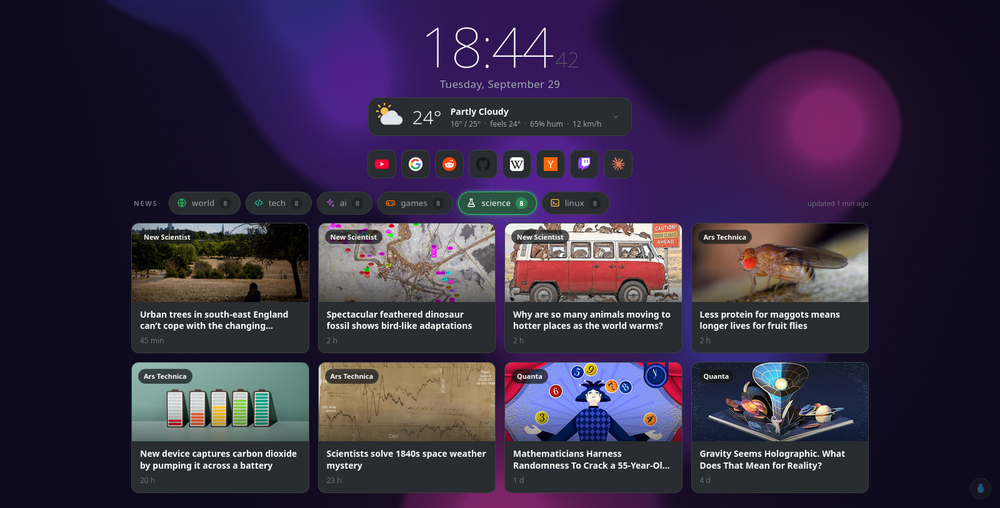
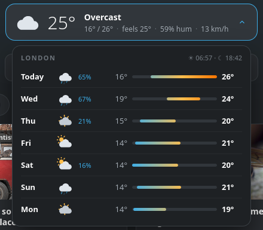
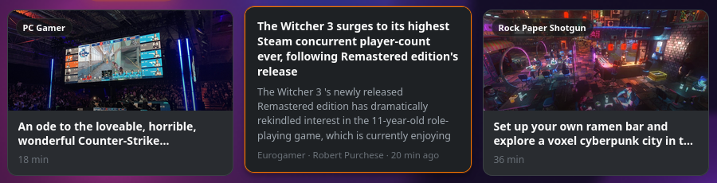

<div align="center">

# startpage

**A new-tab page for Firefox: a big clock, the weather, your sites on single keys, and news cards
from any RSS feed, over a slow lava lamp.**<br>
One HTML file. No build, no extension, no account. Python only to fetch the headlines.

[](#quick-start)
[](https://github.com/cybWasHere/startpage/actions/workflows/install.yml)
[](#quick-start)
[](#quick-start)
[](LICENSE)



</div>

> Vibecoded, and built for one desktop first. [The fine print.](#the-fine-print)

## What you get

- **A clock you can read from across the room**, and the date under it.
- **Weather** from [Open-Meteo](https://open-meteo.com) (free, no key): now, feels-like, and when
  the rain starts or stops. Hover it for the week, with rain chances and a temperature bar per day.
  Icons are animated SVG, and the cloud drifts.
- **Your sites as an icon dock**, each on a single key: press `y` for YouTube, Shift+`y` to open it
  in a new tab, `?` to see every key.
- **News cards in tabs**, from whatever RSS or Atom feeds you list. Every card gets a picture
  (from the feed, or the article's preview image when the feed has none), hovering it shows the
  summary, and headlines you have already opened are dimmed. The page picks how many rows fit your
  screen, so it never scrolls.
- **A lava lamp behind it all**: slow wax blobs in WebGL, drifting through nine dark colour moods
  over six hours. The little lamp at the bottom right opens a menu: pick one mood, let it drift, or
  turn it off. A new mood melts in, and the page remembers your pick. With the "now playing" card
  set up for Pear, a drifting lamp follows the music: it takes the colours of the album cover
  (toned down to the moods' darkness) and moves a touch livelier, then settles back when the music
  stops. A mood you picked keeps its colours. Point `lava.audio` at a WebSocket that sends
  `bass mid high kick level` (five numbers from 0 to 1, many times a second) and the wax moves to
  the sound itself: each colour swells with its own band, kicks shove it, louder flows faster. No
  such server ships with the page yet.
  It's a port of a KDE Plasma wallpaper, so the page and the desktop can match.
  *See-through* in the same menu paints no background at all, for a Firefox set up to show its
  window through the page ([how](#see-through-background)); anywhere else it is a plain dark page.
- **Rain on a button**: real, steady rain that loops without a seam, with distant thunder rolling
  over it at random, so it never comes round the same way. The cloud next to the lamp starts it (or
  press `r`); scroll over it for the volume. It keeps raining while you
  browse: the tab that rains opens links in new tabs, and every other start page shows the cloud
  lit and can stop it.
- **Optional "now playing" card** for [Pear Desktop](https://github.com/pear-devs/pear-desktop) or
  a browser video, with [obs-pear-remote](https://github.com/cybWasHere/obs-pear-remote)'s server.

<div align="center">


<br>

</div>

## Quick start

```sh
git clone https://github.com/cybWasHere/startpage
cd startpage
python3 install.py        # Windows: py install.py
```

It asks for your city (for the weather), fetches the first headlines, and asks once for admin
rights to hook the page into Firefox. **Quit Firefox completely and start it again.** New tabs and
new windows now open the page.

No git? *Code › Download ZIP* works too; unzip it somewhere it can stay, because Firefox loads the
page from that folder. Move the folder later and just run `install.py` again.

<details>
<summary><b>Requirements</b></summary>
<br>

- **Firefox**, installed the normal way (see [Snap, Flatpak and other browsers](#snap-flatpak-and-other-browsers)
  for the rest). The page itself works in any modern browser.
- **Python 3.8 or newer**, standard library only, nothing to `pip install`.
  - **Windows**: install it from [python.org](https://www.python.org/downloads/) (that gives you `py`).
  - **macOS**: python.org's installer or `brew install python`. With python.org's, also run
    *Install Certificates.command* from its folder in Applications, or every feed fails with an SSL error.
  - **Linux**: you almost certainly have it.

</details>

<details>
<summary><b>What the installer does</b> &nbsp;·&nbsp; <a href="install.py">read it first if you like</a></summary>
<br>

1. **Your settings.** Copies `config.example.js` to `config.js` and `feeds.example.json` to
   `feeds.json`, unless you already have them. Those two files are yours: git ignores them, so
   `git pull` never touches them.
2. **Headlines.** Runs `news.py` once, then every 20 minutes:

   | | how | where |
   |---|---|---|
   | Linux | systemd user timer (or a crontab line it prints, without systemd) | `~/.config/systemd/user/startpage-news.timer` |
   | macOS | launchd agent | `~/Library/LaunchAgents/io.github.cybwashere.startpage-news.plist` |
   | Windows | Task Scheduler, windowless (`pythonw`), also on battery | task `startpage-news` |

3. **Firefox.** Writes two small files into Firefox's install folder, using Firefox's own
   [autoconfig](https://support.mozilla.org/kb/customizing-firefox-using-autoconfig) mechanism:
   `defaults/pref/autoconfig.js` and `mozilla.cfg`. The second one sets the homepage and the new-tab
   page to this folder's `index.html`, and that's all it does. It's the only step that needs admin
   rights (`sudo` on Linux and macOS, a UAC prompt on Windows). If a `mozilla.cfg` from something
   else is already there, the installer leaves it alone unless you pass `--force`, which keeps a
   `.bak` copy.

Run it again any time; it only redoes what's needed.

| flag | |
|---|---|
| `--city "Paris"` | set the weather city without being asked (`-` for no weather) |
| `--no-firefox` | skip step 3, e.g. to set the homepage yourself |
| `--force` | replace a `mozilla.cfg` another tool wrote |
| `--serve [PORT]` | Linux: open the page from `http://127.0.0.1:9875` instead of from the file (below) |
| `--uninstall` | remove the schedule and the Firefox files; your settings stay |

**Served instead of opened as a file (`--serve`).** Opened from the file, the page has no address:
to any program on your machine its requests come from `null`, exactly like those of a hidden frame
on any website. A local service that tells the page what is playing can't tell the two apart, so
the careful ones refuse both ([lavaglass](https://github.com/cybWasHere/lavaglass)'s lamp-audio
does, and so does obs-pear-remote's `serve.py`). `python3 install.py --serve` gives the page an
address they can check: a systemd user unit runs `serve.py` on loopback, and Firefox opens
`http://127.0.0.1:9875/` on new tabs. Then name that address to the service
(`LAMP_AUDIO_ORIGINS=http://127.0.0.1:9875`, `serve.py --allow-origin http://127.0.0.1:9875`).
The server answers the page and nobody else: a request from another site is refused, so no page
can read your `config.js`. What the page remembers (mood, rain volume, last tab) starts fresh
once, since browsers keep it per address. Run `install.py` without `--serve` to go back.

</details>

## Make it yours

Everything lives in two files next to `index.html`. Save, then open a new tab. There's nothing to
restart.

**`config.js`**: links, weather, clock.

```js
window.STARTPAGE = {
  links: [
    ["YouTube", "https://www.youtube.com", "y"],   // [name, url, key]
    ["GitHub",  "https://github.com",      "g"],
  ],
  weather: { city: "Lyon" },   // or { name: "Home", lat: 45.76, lon: 4.84 }, or null
  units: "metric",             // or "imperial" for °F
  clock24: true,               // false for 1:42 pm
  seconds: true,
  locale: "",                  // date language like "fr-FR"; "" follows the browser
  lava: { on: true, mood: "", music: true, cycleHours: 6, speed: 1, brightness: 1, fps: 30 },
  rain: true,                  // false hides the rain button; { thunder: false } is rain only
  nowPlaying: null,
};
```

**`feeds.json`**: news tabs, in the order you want them, each with any number of feeds. The
headlines refresh every 20 minutes. To see a change right away, run `python3 news.py` (Windows:
`py news.py`).

```json
{
  "perTab": 8,
  "tabs": {
    "world": [["BBC", "https://feeds.bbci.co.uk/news/world/rss.xml"]],
    "games": [["Rock Paper Shotgun", "https://www.rockpapershotgun.com/feed"],
              ["PC Gamer", "https://www.pcgamer.com/rss/"]]
  }
}
```

Each feed gets an equal share of its tab, so one busy site can't push out the others. Tabs called
`world`, `tech`, `ai`, `games`, `science`, `linux`, `music`, `geopolitics` or `france` get their own
colour and icon; any other name gets the accent colour and a dot. Colours and icons are in
`TAB_META` in `index.html`, and the whole look is CSS variables at the top of it.

## Snap, Flatpak and other browsers

The Firefox hookup needs a Firefox whose install folder can be written to. Ubuntu's default
**Snap** Firefox and **Flatpak** Firefox can't be, and Chrome-family browsers don't allow a local
file as the new-tab page at all. You can still make it your **homepage**:

1. Run `python3 install.py --no-firefox` for the settings and headlines.
2. Open `index.html` in the browser, copy the `file:///…` address from the address bar, and paste
   it as the homepage (Firefox: *Settings › Home › Homepage and new windows › Custom URLs*).

New tabs stay the browser's own. On Ubuntu, Mozilla's
[.deb package](https://support.mozilla.org/kb/install-firefox-linux) replaces the Snap and works
with the installer.

## Good to know

- **Why Python?** A page opened from disk may not fetch other sites' feeds (browsers block it), but
  it may load a script next to it. So `news.py` fetches the feeds and writes them into `news.js`,
  and the page reads that. Weather is fetched live, since Open-Meteo allows it.
- **What it talks to:** Open-Meteo for weather and the city lookup (the result is remembered), the
  feeds you list, the sites' images for the cards (sent without a referrer), and DuckDuckGo's icon
  service for the dock icons. No analytics, no accounts.
- **The lava lamp** renders at half resolution and 30 fps (it's all soft gradients, so it looks the
  same), and stops whenever the tab is in the background. With *reduce motion* set in your system,
  it draws one still frame. No WebGL? The button just doesn't appear.
- **The rain** is a recording, not a generator: all of it is cut from "Rain on Concrete during storm
  with thunder" by Dakendzor on
  [Wikimedia Commons](https://commons.wikimedia.org/wiki/File:Rain_on_Concrete_during_storm_with_thunder.wav).
  The bed is four minutes of the storm's steady rain, joined into a loop whose end runs into its
  start. Ten thunder rolls are kept apart from it and played every 5 to 43 seconds, each time at a
  different distance, pitch and side. It plays through Web Audio, so the loop point is exact to the
  sample and the browser doesn't count it as a media player: your play/pause key and "now playing"
  widgets keep following your music. `rain.js` (7 MB) is only loaded when you first press the
  button. `rain: { thunder: false }` in `config.js` keeps the rain and drops the thunder.
- **Updating:** `git pull`. Your `config.js` and `feeds.json` are untouched. Rerun `install.py`
  only if you moved the folder.
- **Uninstall:** `python3 install.py --uninstall`, restart Firefox, delete the folder.

## See-through background

*See-through* in the lamp menu (or `lava: { mood: "glass" }`) leaves the page without a background.
That only shows something on a desktop that already draws Firefox's window translucent (a
compositor with blur, and a `userChrome.css` that clears the window's own background). Then:

1. In `about:config`, set `browser.tabs.allow_transparent_browser` to `true` and restart Firefox.
2. In `userChrome.css`, clear the backdrop Firefox paints behind the page, for this page's tab only:
   ```css
   body:has(.tabbrowser-tab[selected][label="New Tab"]) #tabbrowser-tabpanels {
     --tabpanel-background-color: transparent !important;
   }
   ```

The setting applies to every tab: a site that sets no background of its own (plain text files,
some very old pages) is then drawn on `--tabpanel-background-color` instead of white, so keep that
colour readable.

## Troubleshooting

| you see | why, and what to do |
|---|---|
| **New tabs are still Firefox's** | Firefox wasn't fully restarted. Quit it (the Quit menu item, or Ctrl+Q / ⌘Q), then start it again. If that doesn't help, it's a Snap or Flatpak Firefox: see [above](#snap-flatpak-and-other-browsers). |
| **No news section** | `news.js` doesn't exist yet. Run `python3 news.py` and read what it says. |
| **"updated 3 d ago"** | The schedule isn't running. Linux: `systemctl --user status startpage-news.timer`. macOS: `launchctl list \| grep startpage`, and look in `news.log`. Windows: Task Scheduler › `startpage-news` › History. |
| **Every feed fails with `CERTIFICATE_VERIFY_FAILED`** | macOS with python.org's Python: run *Install Certificates.command* from `/Applications/Python 3.x/`. |
| **macOS: `Operation not permitted` while writing into Firefox.app** | macOS protects apps from being changed. Allow your terminal under *System Settings › Privacy & Security › App Management*, then run the installer again. |
| **macOS: headlines never refresh, but `python3 news.py` works** | The folder is in Desktop, Documents or Downloads, which background jobs may not read. Move it (e.g. to `~/startpage`) and rerun `install.py`. |
| **The new tab went back to normal after a Firefox update** | Some updates (mostly on macOS) replace the whole install folder. Rerun `install.py`. |
| **No weather** | The city wasn't found. Use the English name, or give `lat`/`lon` instead. |
| **A letter instead of a site's icon** | DuckDuckGo has no icon for that site. The letter is the fallback. |

## The fine print

**Vibecoded.** The code and these docs were written by Claude, an AI coding agent, directed by the
repo owner, who uses the page every day on Linux (CachyOS, Firefox 156). On every push, and weekly,
[GitHub Actions](.github/workflows/install.yml) runs the installer on fresh Linux, macOS and Windows
machines, fires the schedule, checks that a headless Firefox starts on the page, then uninstalls and
checks that nothing is left. What it can't see is the admin prompt, since those machines are already
admin, so the UAC and App Management steps are the least tested part. Read `install.py` before you
trust it; it's short.

**Thanks** to [Open-Meteo](https://open-meteo.com) for free weather without keys, and to every site
that still publishes an RSS feed.

**License.** MIT, see [LICENSE](LICENSE), except `rain.js`: those recordings are adapted from
"Rain on Concrete during storm with thunder" by Dakendzor and are
[CC BY-SA 4.0](https://creativecommons.org/licenses/by-sa/4.0/) like their source. The headlines,
images and icons belong to their publishers.
